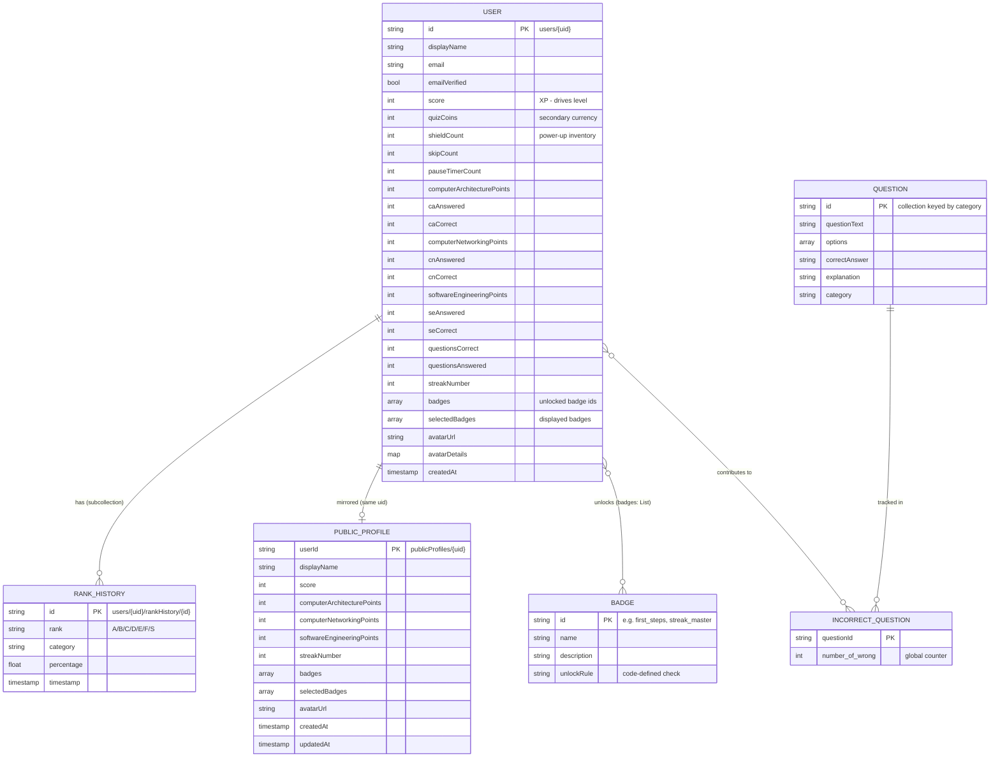
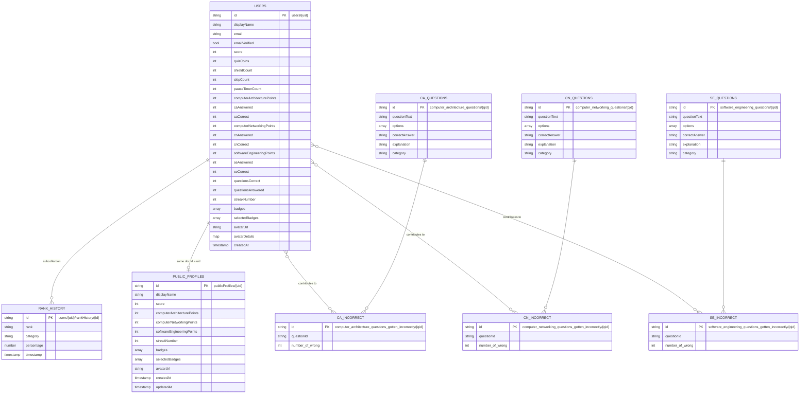

# Gamified Quiz App — Entity Relationship Diagrams

> Generated from `lib/models/`, `lib/services/`, and `firestore.rules`.

## 1. Logical ERD

Entities and relationships (source: `docs/erd_logical.mmd`).

## 2. Physical Firestore Collections

Source: `docs/erd_firestore.mmd`.

## Key notes

- **`users` ↔ `publicProfiles`** — 1:1 by shared document ID (`uid`). `users` is private (email, power-up inventory, per-category stats); `publicProfiles` is a publicly-readable leaderboard mirror.
- **`rankHistory`** is a Firestore **subcollection** under each user: `users/{uid}/rankHistory/{id}`.
- **Badges** are not stored as documents — the 50+ `BadgeDefinition`s live in code (`lib/models/badge.dart`); the DB stores only a denormalized `badges: List<String>` of unlocked IDs.
- **`*_gotten_incorrectly`** collections are keyed by `questionId` (global counters, not per-user).
- **Non-DB data**: `LevelSystem` (derived from `score`), `ShopItem` (static store items), `AvatarOptions` (DiceBear traits), and `GuestUser`/`GuestProgress` (persisted locally via `SharedPreferences`).
