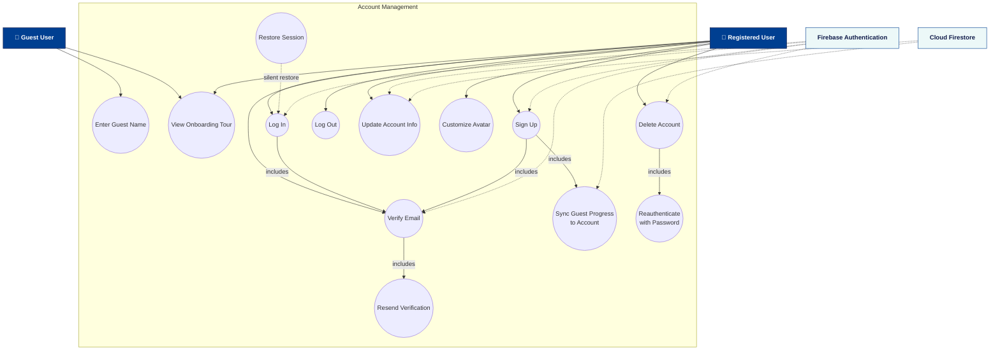
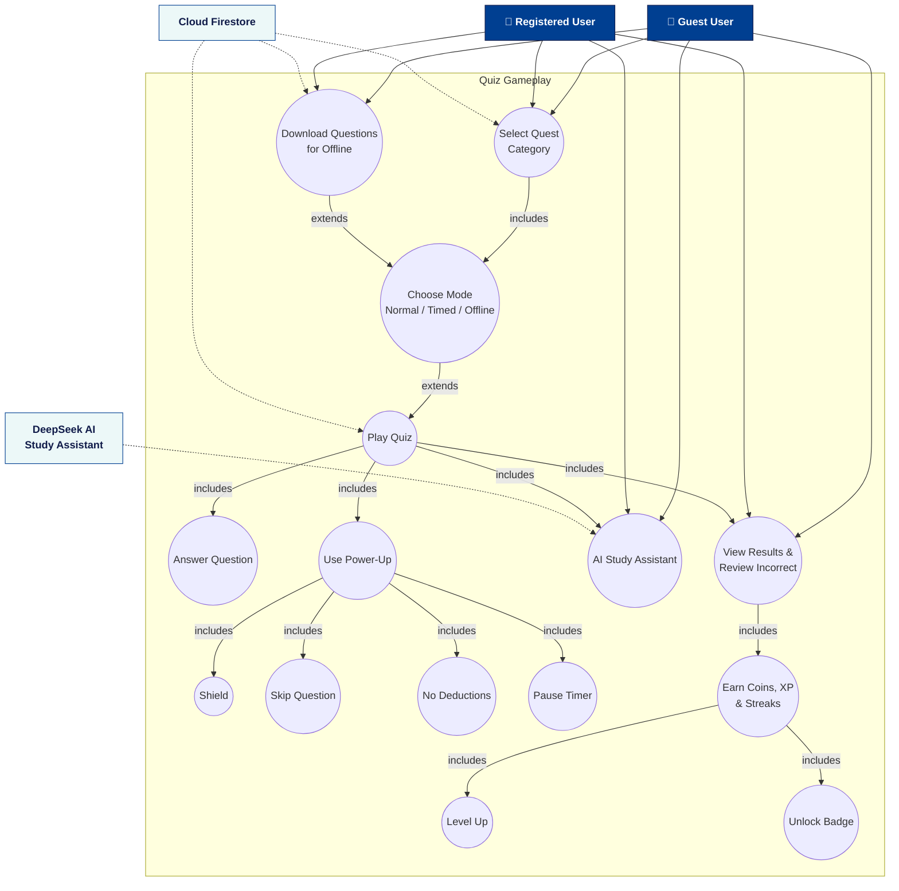
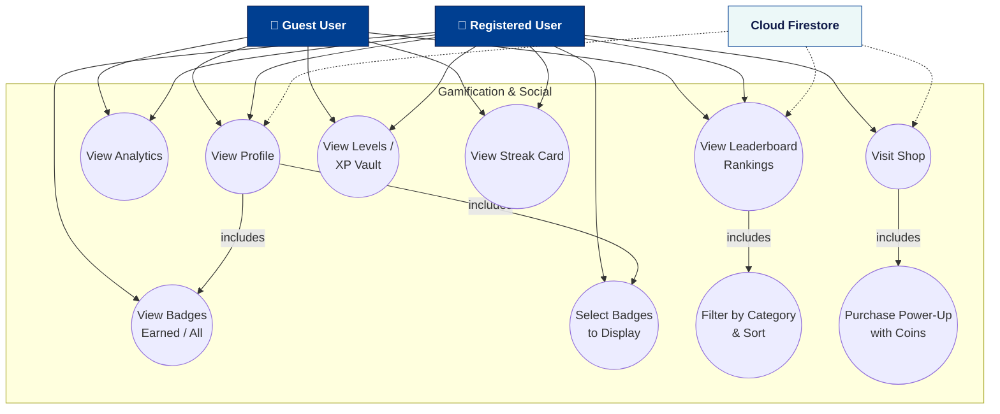
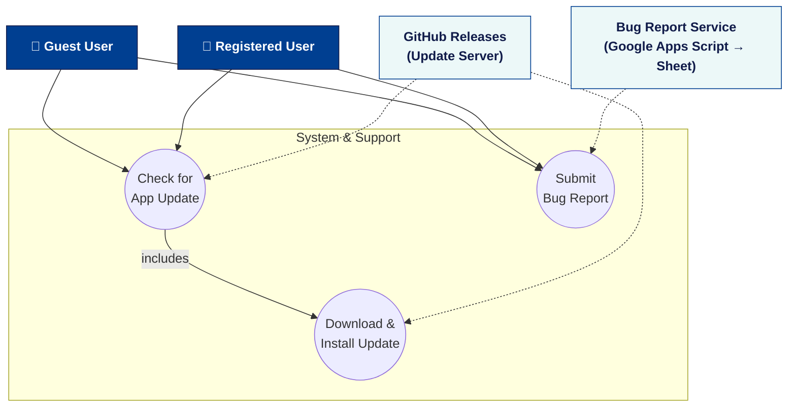

# Gamified Quiz App — Use Case Diagrams

> Generated from `lib/screens/`, `lib/widgets/`, and `lib/services/`.
> Sources: `docs/use_case_*.mmd` (renderable via the Mermaid extension / `mermaid-cli`).

## Actors

| Actor                           | Description                                                                                                                         |
| ------------------------------- | ----------------------------------------------------------------------------------------------------------------------------------- |
| **Guest User**                  | Plays quizzes without an account. Progress (score, streaks, badges-free stats) is stored **locally** on the device.                 |
| **Registered User**             | Signed in with email/password and verified email. Can sync guest progress, earn/persist badges & coins, access shop, rankings, etc. |
| **Firebase Authentication**     | External identity system (sign-up, sign-in, email verification, session restore).                                                   |
| **Cloud Firestore**             | External data store for user profiles, stats, rankings, quiz questions, and power-up inventory.                                     |
| **DeepSeek AI Study Assistant** | External AI service providing real-time study tips and chat during/after quizzes.                                                   |
| **Bug Report Service**          | Google Apps Script web app that appends bug reports to a Google Sheet.                                                              |
| **GitHub Releases**             | External update server hosting signed APK/AAB releases.                                                                             |

> **Generalization:** _Registered User_ —|> _Guest User_ (a registered user can do everything a guest can, plus account-based features).

---

## 1. Overall System Context

```mermaid
flowchart LR
    classDef actor fill:#003F91,stroke:#111C4A,color:#ffffff,font-weight:700;
    classDef system fill:#ECF8F8,stroke:#003F91,color:#111C4A,font-weight:600;
    classDef uc fill:#ffffff,stroke:#003F91,color:#111C4A;

    GU["👤 Guest User"]:::actor
    RU["👤 Registered User"]:::actor
    RU --|> GU

    subgraph APP[Gamified Quiz Application]
        direction LR
        UC_AUTH(("Auth &<br/>Account"))
        UC_QUIZ(("Quiz<br/>Gameplay"))
        UC_GAM(("Gamification<br/>& Social"))
        UC_SUP(("System &<br/>Support"))
    end

    GU --> UC_QUIZ
    GU --> UC_GAM
    GU --> UC_SUP
    RU --> UC_AUTH
    RU --> UC_QUIZ
    RU --> UC_GAM
    RU --> UC_SUP

    FA["Firebase Authentication"]:::system
    FS["Cloud Firestore"]:::system
    AI["DeepSeek AI<br/>Study Assistant"]:::system
    BR["Bug Report Service<br/>(Google Sheets)"]:::system
    GH["GitHub Releases<br/>(Update Server)"]:::system

    FA -.-> UC_AUTH
    FS -.-> UC_AUTH
    FS -.-> UC_QUIZ
    AI -.-> UC_QUIZ
    FS -.-> UC_GAM
    BR -.-> UC_SUP
    GH -.-> UC_SUP
```

Source: `docs/use_case_overall.mmd`

---

## 2. Authentication & Account Management



Source: `docs/use_case_auth.mmd`

---

## 3. Quiz Gameplay



Source: `docs/use_case_quiz.mmd`

---

## 4. Gamification & Social



Source: `docs/use_case_gamification.mmd`

---

## 5. System & Support



Source: `docs/use_case_support.mmd`

---

## Use Case Catalog

| #   | Use Case                                                   | Primary Actor    | System Support             | Includes / Extends                                          |
| --- | ---------------------------------------------------------- | ---------------- | -------------------------- | ----------------------------------------------------------- |
| 1   | Enter Guest Name                                           | Guest User       | Local storage              | —                                                           |
| 2   | View Onboarding Tour                                       | Guest/Registered | Local storage              | —                                                           |
| 3   | Sign Up                                                    | Registered User  | Firebase Auth, Firestore   | includes: Verify Email, Sync Guest Progress                 |
| 4   | Log In                                                     | Registered User  | Firebase Auth              | includes: Verify Email                                      |
| 5   | Log Out                                                    | Registered User  | Firebase Auth              | —                                                           |
| 6   | Verify Email                                               | Registered User  | Firebase Auth              | includes: Resend Verification                               |
| 7   | Restore Session                                            | Registered User  | Firebase Auth              | silent restore of previous login                            |
| 8   | Update Account Info                                        | Registered User  | Firebase Auth, Firestore   | —                                                           |
| 9   | Customize Avatar                                           | Registered User  | Firestore                  | —                                                           |
| 10  | Delete Account                                             | Registered User  | Firebase Auth, Firestore   | includes: Reauthenticate with Password                      |
| 11  | Select Quest Category                                      | Guest/Registered | Firestore                  | —                                                           |
| 12  | Choose Quiz Mode                                           | Guest/Registered | —                          | extends: Play Quiz                                          |
| 13  | Play Quiz                                                  | Guest/Registered | Firestore                  | includes: Answer Question, Use Power-Up, AI Study Assistant |
| 14  | Use Power-Up (Shield / Skip / No Deductions / Pause Timer) | Registered User  | Firestore                  | included in Play Quiz                                       |
| 15  | AI Study Assistant                                         | Guest/Registered | DeepSeek AI                | included in Play Quiz                                       |
| 16  | Download Questions for Offline                             | Guest/Registered | Firestore → local          | extends: Play Offline                                       |
| 17  | View Results & Review Incorrect                            | Guest/Registered | Firestore / local          | included in Play Quiz                                       |
| 18  | Earn Coins, XP & Streaks                                   | Guest/Registered | Firestore / local          | included in Results                                         |
| 19  | Level Up                                                   | Guest/Registered | —                          | included in Rewards                                         |
| 20  | Unlock Badge                                               | Guest/Registered | Firestore / local          | included in Rewards                                         |
| 21  | View Profile                                               | Guest/Registered | Firestore / local          | —                                                           |
| 22  | View Badges (Earned / All)                                 | Registered User  | Firestore                  | included in Profile                                         |
| 23  | Select Badges to Display                                   | Registered User  | Firestore                  | included in Profile                                         |
| 24  | View Analytics                                             | Guest/Registered | Firestore / local          | —                                                           |
| 25  | View Leaderboard / Rankings                                | Guest/Registered | Firestore                  | includes: Filter by Category & Sort                         |
| 26  | View Levels / XP Vault                                     | Guest/Registered | Firestore / local          | —                                                           |
| 27  | View Streak Card                                           | Guest/Registered | Firestore / local          | —                                                           |
| 28  | Visit Shop & Purchase Power-Up                             | Registered User  | Firestore                  | includes: Purchase with Coins                               |
| 29  | Check for App Update                                       | Guest/Registered | GitHub Releases            | includes: Download & Install                                |
| 30  | Submit Bug Report                                          | Guest/Registered | Google Apps Script → Sheet | —                                                           |
