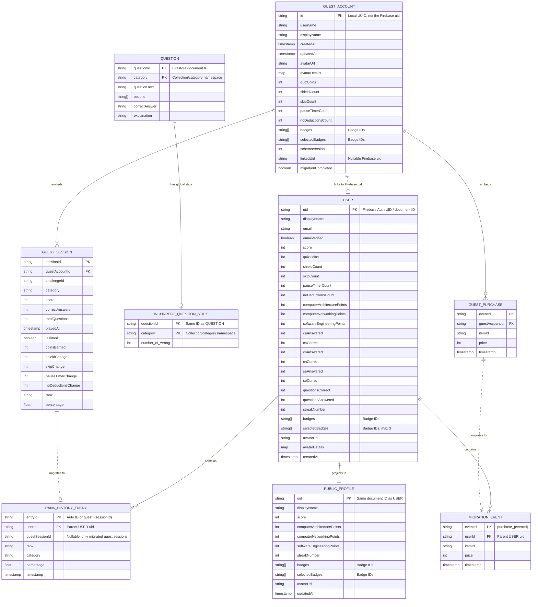

# Entity Relationship Diagram

The diagram below reflects the persisted schema currently used by the application. Firestore subcollections are shown as entities with an explicit `userId` parent key for readability; in Firestore, that key is represented by the document path (`users/{uid}/...`).

## Storage Notes

- `USER`, `RANK_HISTORY_ENTRY`, and `MIGRATION_EVENT` are stored in Firestore under `users/{uid}` and its subcollections.
- `PUBLIC_PROFILE` is a denormalized, publicly readable projection of `USER`, not a second account.
- There are three separate `QUESTION` collections and three matching incorrect-question-stat collections, one pair per category. The `category` attribute above represents that collection namespace.
- `GUEST_ACCOUNT`, `GUEST_SESSION`, and `GUEST_PURCHASE` are local SharedPreferences JSON data. They are cleared after a successful merge into Firebase.
- Badge definitions, shop-item definitions, avatar options, levels, and offline question caches are static or derived data, so they are intentionally not modeled as persisted entities.