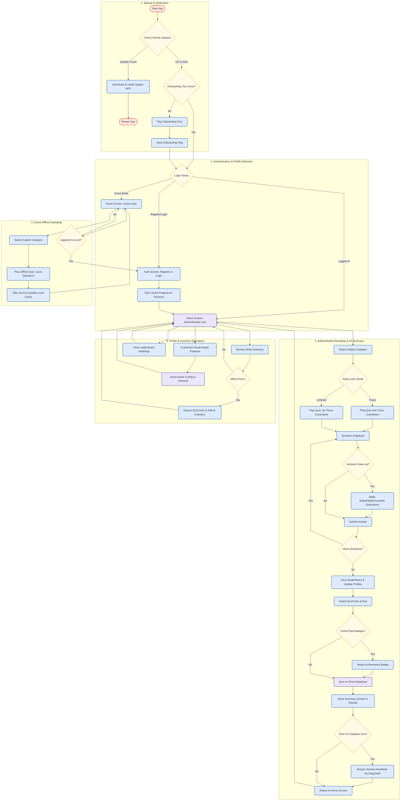

# Application Process Flowchart

This document details the user journeys and internal decision logic for the **Gamified Quiz Application**. It maps out application startup updates, authentication decisions, guest gameplay, and the full interactive online/offline quiz loop.

---

## Process Flowchart

