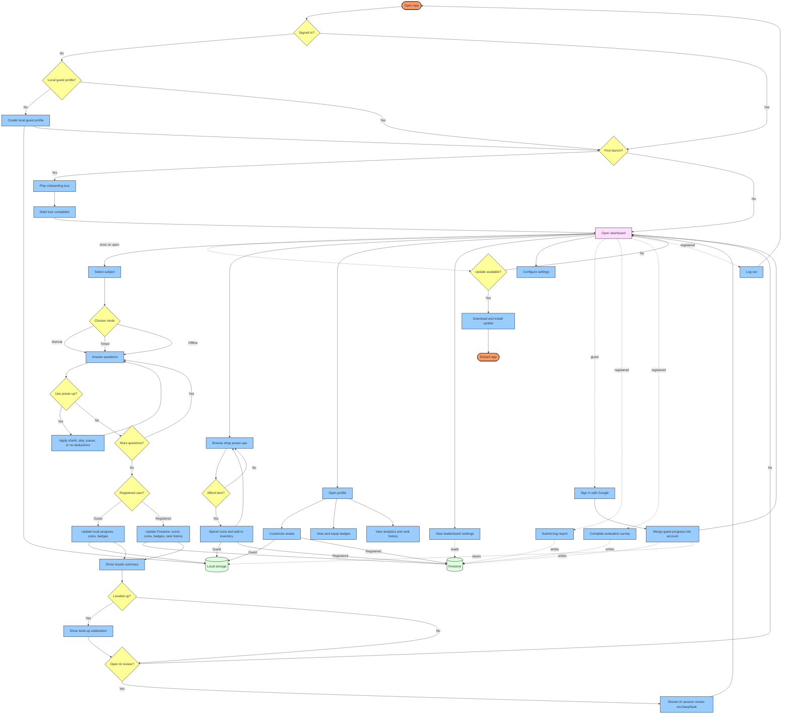

# Gamified Quiz Application Use Case Flow

This flow reflects the implemented Flutter app. The app auto-detects sign-in,
creates a local guest profile when needed, shows onboarding on first launch,
then opens the dashboard. Guests and registered users share the same features;
progress goes to local storage for guests and Firestore for registered users.

## Use Case Flow

## Relationship Notes

- Update checking runs once when the dashboard opens; onboarding plays only on
    the first launch, for both guests and registered users.
- Quiz: select a subject, choose normal, timed, or offline mode, answer
    questions with optional power-ups, then finish. Offline mode always saves
    progress locally.
- Results branch by user: guests update local storage; registered users update
    Firestore (score, coins, badges, and rank history), with an optional
    level-up celebration and AI session review.
- Shop, avatar, badges, analytics, and rankings are shared features. Purchases
    and avatar edits persist locally for guests and in Firestore for registered
    users; rankings read public Firestore data.
- Signing in with Google merges local guest progress into Firestore and clears
    the local copy. Bug reports and evaluation surveys are registered-only, and
    logging out returns to the sign-in check.